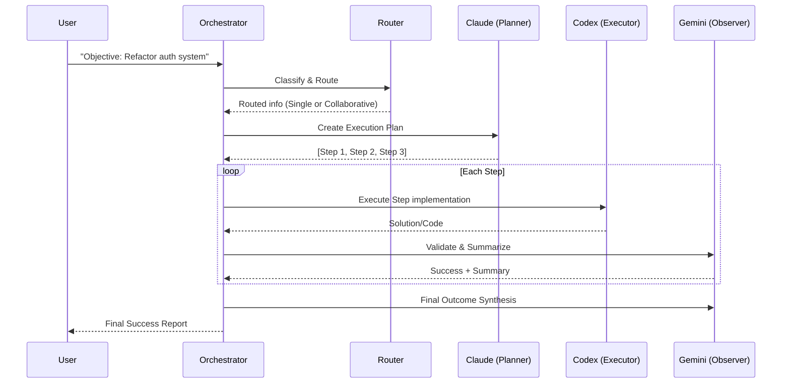

# G CLI - Advanced Multi-Model Intelligence System Architecture

Welcome to the architectural blueprint for **G CLI**. This system is an evolution of Gaia CLI, transformed into a decision-making intelligence layer that orchestrates multiple state-of-the-art AI models.

## 1. Directory Structure

```text
G-CLI/
├── gcli.py                    # New main entry point
├── main.py                    # Legacy entry point (updated)
├── core/
│   ├── orchestrator.py        # GCLI_Orchestrator: The brain that coordinates the cycle
│   ├── prompts.py             # Persona and reasoning framework definitions
│   └── structural_analyzer.py # Codebase AST-like structural parser
├── router/
│   ├── task_classifier.py     # Intent parsing and task categorization
│   └── model_router.py        # DMSE: Dynamic Model Selection Engine
├── models/
│   ├── base_client.py         # Common interface for all model providers
│   ├── claude_client.py       # Anthropic Claude 3.5 (Reasoning & Architecture)
│   ├── gemini_client.py       # Google Gemini 1.5 (Scanning & Summarization)
│   ├── codex_client.py        # OpenAI GPT-4o (High-precision Coding)
│   └── __init__.py            # ModelFactory for lazy client instantiation
├── memory/
│   ├── vector_db.py           # Shared ChromaDB vector store
│   ├── rag_pipeline.py        # Multi-collection RAG (Knowledge, Reasoning, Arch)
│   ├── long_term_memory.py    # Hierarchical summarization and reasoning storage
│   └── learning_daemon.py     # ALE: Autonomous Learning Engine background process
├── agent/
│   ├── planner.py             # Strategic planning using Claude
│   ├── executor.py            # Technical implementation using Codex
│   └── observer.py            # Validation and summarization using Gemini
└── system/
    ├── file_manager.py        # Unified file system operations
    └── command_runner.py      # Shell and Git command execution
```

---

## 2. Dynamic Model Selection Engine (DMSE)

The core innovation of G CLI is the **DMSE**. It classifies tasks and routes them to the optimal brain:

*   **Claude 3.5 Sonnet**: Used for complex reasoning, architectural planning, and system design.
*   **Codex (GPT-4o)**: Used for high-precision code generation, debugging, and direct implementation.
*   **Gemini 1.5 Pro**: Used for multimodal tasks, fast summarization, and technical observation/validation.

## 3. Multi-Model Collaboration Mode

Instead of using a single model, G CLI can operate in a collaborative "Swarm" mode:
1.  **Claude Plans**: Breaks down the objective into a strategic roadmap.
2.  **Codex Executes**: Implements each step with technical precision.
3.  **Gemini Observes**: Validates the output, summarizes the progress, and updates memory.

## 4. Shared Memory Substrate

All models operate on a unified memory substrate:
*   **Knowledge Base**: Traditional RAG chunks.
*   **Reasoning Substrate**: Extracted design decisions and "why" patterns.
*   **Architectural Graph**: Structural relationships between files and symbols.

---

## 5. Execution Flow


